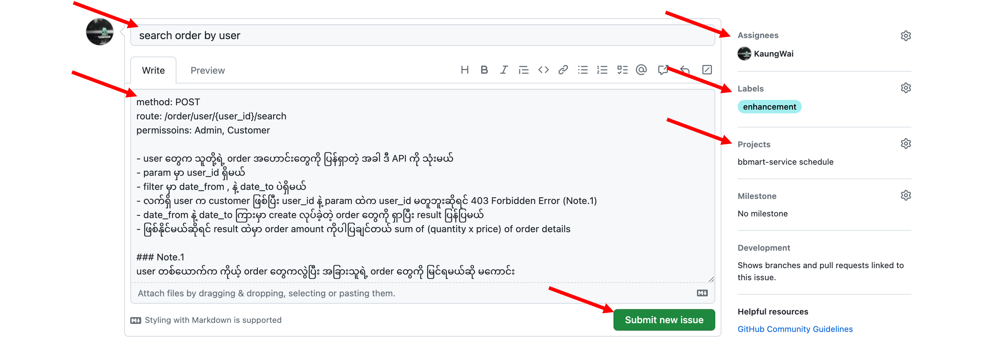
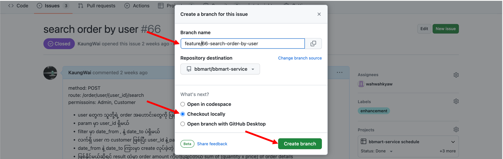

# Contribution guidelines

New feature, bug fix တွေအားလုံးကို github issue တွေနဲ့ tracking လုပ်မှာဖြစ်တဲ့အတွက် ဘာပဲလုပ်လုပ် github issue အသစ်တစ်ခုဖွင့်ပါ။

## Create an issue

ပထမဦးဆုံးအနေနဲ့ issue အသစ်တစ်ခုတည်ဆောက်ပါ။
 
အောက်က အချက်အလက်တွေကိုဖြည့်ပြီး submit new issue ကိုနှိပ်ပါ။

-   title
-   description
-   assignee
-   label
-   project

## Create a branch

issue ထဲကနေပဲ branch အသစ်တစ်ခုဆောက်ပါ။

## Checkout

အပေါ်မှာအသစ်ဖွင့်ခဲ့တဲ့ issue ကို local မှာ checkout လုပ်ပါ။ develop ဒီအပါ်မှာ ဆက်လုပ်သွားပါ။ Commit တင်တဲ့အခါ Commit guidelines ကို လိုက်နာပါ။

## Pull request

develop, testing လုပ်ပြီးတဲ့အခါ main branch ဆီကို pull request လုပ်ပါ။
